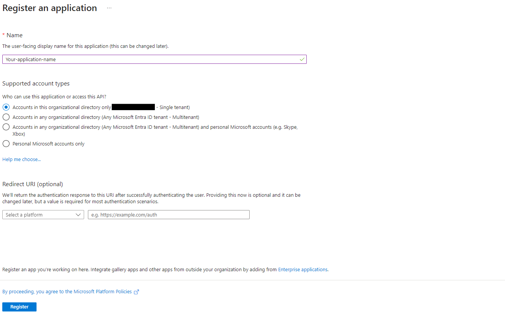
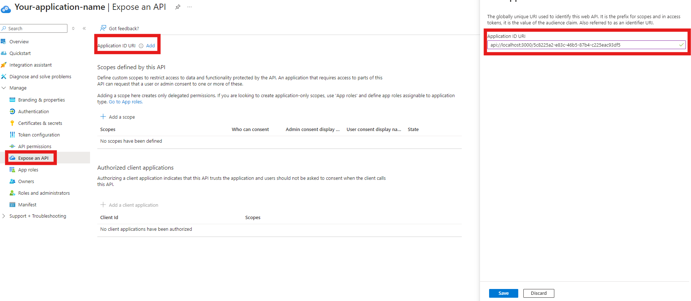
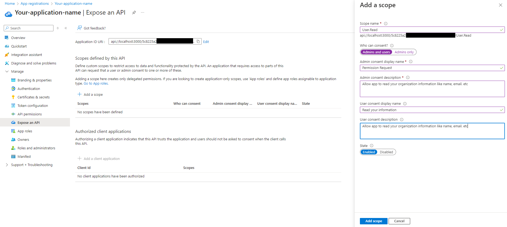
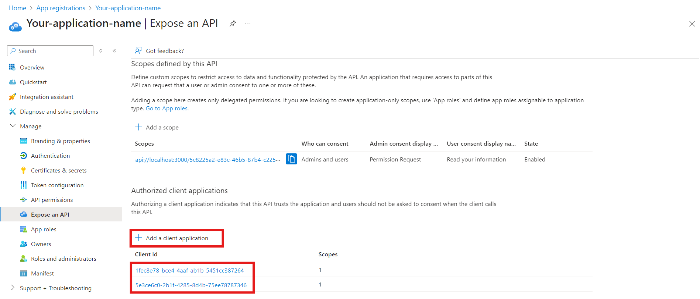
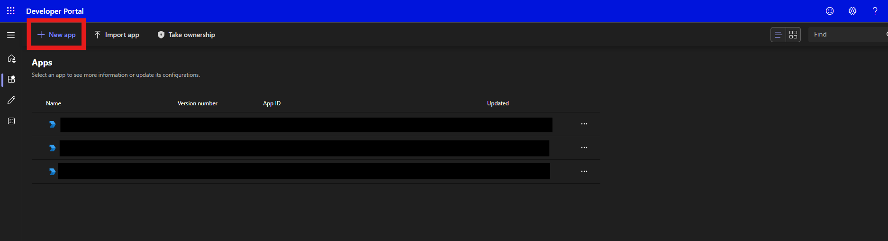
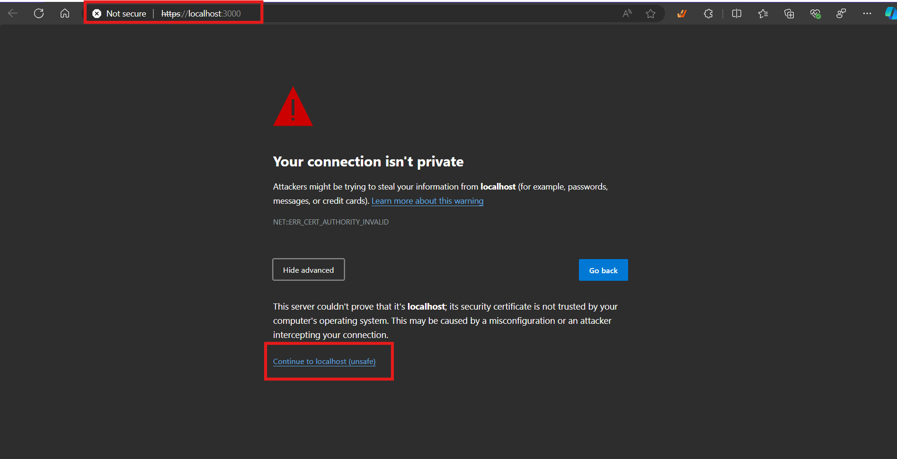
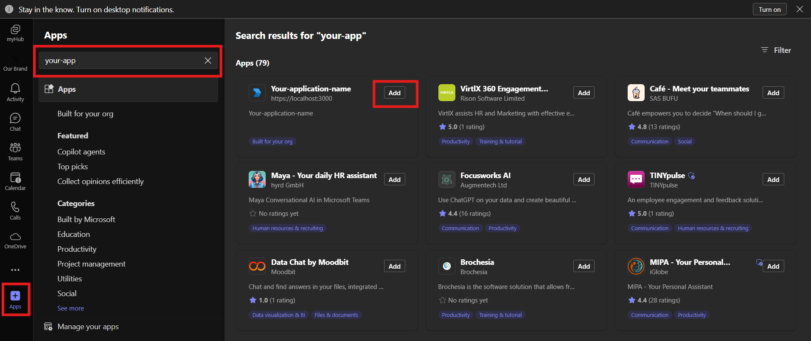
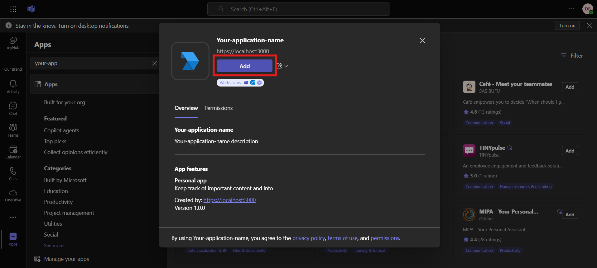
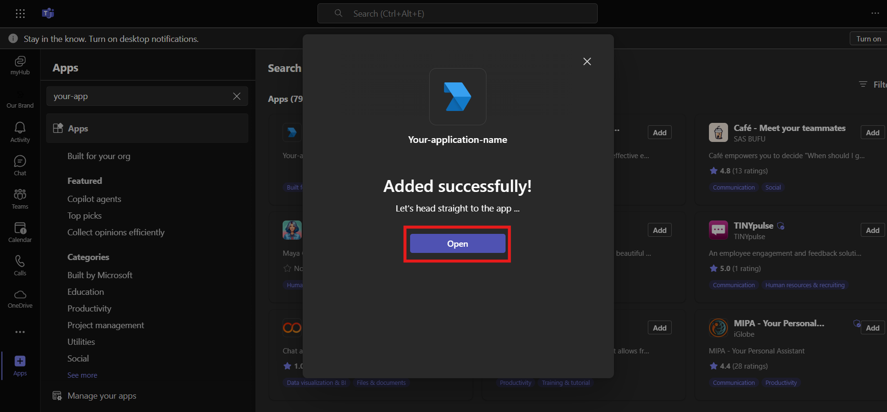
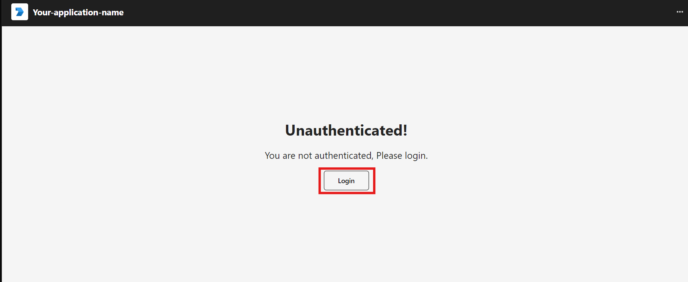

# **Building a React Application with Microsoft Teams Authentication**

### Introduction:

In this post, you'll learn how to configure and build a React application that authenticates exclusively within Microsoft Teams. This guide focuses on integrating authentication directly with Teams, providing a seamless user experience in the platform. While it's possible to add browser-based authentication using MSAL, we'll keep the focus solely on Teams authentication for simplicity.

> [!CAUTION]
> We are not going to use the [Microsoft Teams Toolkit](https://learn.microsoft.com/en-us/microsoftteams/platform/toolkit/teams-toolkit-fundamentals), since I found it full of issue and if you don't have almost complete control aver the MS Teams environment of your organization iis going to be almost impossible to use which will be the case for almost every person because of security concerns.
> This post will focus on a way to work on teams where several administrators are involved and you will require to work with them.

> [!CAUTION]
> In order for you not to waste time you should be working with your Teams administrator or be one to approve our application in Teams, also you need to have Application Administrator, Cloud Application Administrator or above to create the App Registration both are necessary for our authentication or again know who these admin is.

**Why Authenticate in Microsoft Teams?**

- Streamlined Experience: Users stay within the familiar Teams environment without needing to switch apps or browsers.
- Enhanced Security: By leveraging Teams authentication, you reduce the risk of unauthorized access outside the platform.
- Seamless User Management: Leverage Microsoft’s existing identity platform, making user management and permissions easier within your app.

Feel free to extend the project with browser authentication using MSAL if needed, but this guide will help you set up Teams-first authentication.

## let's set up our development environment

### App Registration Configuration

First thing is to configure your app registration if you don't know what azure app registration is, here you have a simple description.

> [!TIP]
> Azure App Registration is a process in Azure Active Directory that lets you register your apps to give them an identity. This allows your apps to securely access and use Azure services. By registering, you can set up how your app will authenticate, define what it can access, and manage permissions. It's essential for integrating your apps with Azure and ensuring secure, managed access to resources.
>
> Find More information [Azure App Registration](https://learn.microsoft.com/en-us/security/zero-trust/develop/app-registration)

<br>

1. First let's create the your App registration in [Azure Portal](https://portal.azure.com/#view/Microsoft_AAD_RegisteredApps/ApplicationsListBlade)

   > [!CAUTION]
   > Note: if don't have admin role in your tenant or the necessary permissions you will not be able to create the App registration so contact these admin in your organization

   1. You or your tenant admin needs to create the app registration, name it as your application so you can find it easier.

   <br>

   

   <br>

   2. We are going to configure our ID URI which will be our audience and will help us identify our application and protect our backend that we can configure to accept only tokens with this specific audience.

   <br>

   

   <br>

   3. Add a scope for the permissions you need,delegated permissions are recommended on the client application you can handle higher permissions in the backend with the "on_behalf" permission so your app is more secure.

   <br>

   

   <br>

   4. Now we need to authorize MS Teams to log in users. This id "1fec8e78-bce4-4aaf-ab1b-5451cc387264" will authorize the desktop application and "5e3ce6c0-2b1f-4285-8d4b-75ee78787346" will authorize the web application.

   <br>

   

   > [!CAUTION]
   > Use the exact id's these are not an example these are used by every developer that wants to use MS Teams

### Create your application in teams

1. Next thing we have to do is create and configure an application in the [Developer Portal](https://dev.teams.microsoft.com/apps).

   <br>

   1. You can go to the [Developer Portal](https://dev.teams.microsoft.com/apps) and create your application.

   <br>

   

   2. Once created we need to configure some values in the "Basic Information" section, fill the names and descriptions this way the user can know what the application does and identify it easier, to enable the authentication you will need the Client ID of your App Registration this is extremely important for the next step.

   <br>

   

   <br>

   3. Go to the "single sign-on" section and here we are going to add the ID URI, if you did not configure correctly the "App Id" in the last step you will get an error, once you added your ID save and go to the next step.

   <br>

   

   <br>

   4. Go to the "App features" section here we will configure the the URL of our service, you will see several options you can go in detail for each if you want but for this exercise we will focus on the "Personal app" feature.

   <br>

   

   <br>

   5. In here we will configure our URL application you can put your your environment URL since we are going to work locally i will use "https://localhost:3000", you have to use HTTPS protocol Teams will not accept HTTP.

   <br>

   

   <br>

   6. Now we have to publish our application click on the "Publish" button and choose "Publish to your org" or go to the "Publish to org" section and Publish your app.

   <br>

   

   <br>

   7. Now that our application is published we need a Teams Administrator to approve our application in the [Teams admin portal](https://admin.teams.microsoft.com/) so it will be visible for the organization, Sometimes it can take a couple of hours for the application to be visible and available in the teams app store.

   <br>

   > [!CAUTION]
   > Without this approval the application won't be available for the users.

### Let's create the application

1. Let's create an application using

```
npx create-react-app  <your-app-name>  --template typescript
```

2. Go to your project

```
cd <your-app-name>
```

3. Now let's install the teams sdk

```
npm install --save @microsoft/teams-js
```

4. You can skip this tep but you can install the Fluent UI that is a collection of UI component that you can use inside of Teams

```
npm install --save @fluentui/react-components
```

5. Also you can work with sass for styling your application

```
npm install sass --save-dev
```

### Configure your code

1. In your index.tsx to enable fluent UI components you should enclose your app with the FLuentProvider

   ```
   import React from "react";
   import ReactDOM from "react-dom/client";
   import "./index.css";
   import App from "./App";
   import reportWebVitals from "./reportWebVitals";
   import { FluentProvider, webLightTheme } from "@fluentui/react-components";

   const root = ReactDOM.createRoot(
   document.getElementById("root") as HTMLElement
   );
   root.render(
   <React.StrictMode>
      <FluentProvider theme={webLightTheme}>
         <App />
      </FluentProvider>
   </React.StrictMode>
   );

   reportWebVitals();
   ```

2. Let's create our unauthenticated component here the user will authenticate, the recommendation is to have the user execute a click in order to get the token
   <br>

   1. import the necessary components from teamsjs
      <br>
      ```
      import {app as teamsApp, authentication as teamsAuthentication} from "@microsoft/teams-js";
      ```
   2. Now we are creating a function that will handle the login

      - The initialize function will authenticate the user and initialize the library
      - if we get any error we notify teams with notifyFailure this do not show any error message to the user

      ```
      function handleClickLogin() {
         teamsApp
            .initialize()
            .then(() => {
            getClientToken(); //this function will handle the token acquisition, we will defined it later
            })
            .catch((error) => {
            teamsApp.notifyFailure(error);
            });
      }
      ```

   3. The teams library can handle the token request each time we need the token this is to improve our application security.
      ```
      function getClientToken() {
         teamsAuthentication
            .getAuthToken()
            .then((result) => {
            handleLogin(result);
            })
            .catch((error) => {
            teamsApp.notifyFailure(error);
            });
      }
      ```
      4. Let's create a component that provides a button for user authentication.
      ```
         <div className="unauthenticated-view-container">
         <Text size={800} weight="bold">
            Unauthenticated!
         </Text>
         <Text size={500}>You are not authenticated, Please login.</Text>
         <Button
            className="unauthenticated-button"
            onClick={handleClickLogin}
            disabled={teamsApp.isInitialized()}>
            Login
         </Button>
      </div>
      ```

   - You can see a template for the user to authenticate here, In this project the file is Unauthenticated.tsx

     ```
        import { Button, Text } from "@fluentui/react-components";
        import {
        app as teamsApp,
        authentication as teamsAuthentication,
        } from "@microsoft/teams-js";
        import "./Unauthenticated.scss";

        interface IUnauthenticatedProps {
        readonly handleLogin: Function;
        }

        function Unauthenticated({ handleLogin }: IUnauthenticatedProps): JSX.Element {
        function handleClickLogin() {
           teamsApp
              .initialize()
              .then(() => {
              getClientToken();
              })
              .catch((error) => {
              teamsApp.notifyFailure(error);
              });
        }

        function getClientToken() {
           teamsAuthentication
              .getAuthToken()
              .then((result) => {
              handleLogin(result);// This function  will let the parent component that we have a token and you can send the token to the backend
              })
              .catch((error) => {
              teamsApp.notifyFailure(error);
              });
        }

        return (
           <div className="unauthenticated-view-container">
              <Text size={800} weight="bold">
              Unauthenticated!
              </Text>
              <Text size={500}>You are not authenticated, Please login.</Text>
              <Button
              className="unauthenticated-button"
              onClick={handleClickLogin}
              disabled={teamsApp.isInitialized()}
              >
              Login
              </Button>
           </div>
        );
        }

        export default Unauthenticated;
     ```

3. Now that we have an authenticated user we will set the a state to know we have an authenticated user and a token you can use to send it to your backend. In our app.tsx you can use something like this.

   ```
   import { useState } from "react";
   import "./App.css";
   import Unauthenticated from "./Views/Unauthenticated/Unauthenticated";
   import Authenticated from "./Views/Authenticated/Authenticated";

   function App() {
   const [isAuthenticated, setIsAuthenticated] = useState(false);

   function handleLogin(token: string) {
      if (token) {
         //You can use the token here, I am only setting the state to true but you can send this token to the backend.
         setIsAuthenticated(true);
      }
   }
   return (
      <div className="App">
         {isAuthenticated ? (
         <Authenticated />
         ) : (
         <Unauthenticated handleLogin={handleLogin} />
         )}
      </div>
   );
   }

   export default App;
   ```

4. You have a token now that you can send to the backend you may need another eventually, to get another token if needed you can use getAuthToken. like I am using in the Authenticated.tsx component.

   ```
   import { useEffect, useState } from "react";
   import {
   app as teamsApp,
   authentication as teamsAuthentication,
   } from "@microsoft/teams-js";
   import { Text } from "@fluentui/react-components";
   import "./Authenticated.scss";

   function Authenticated(): JSX.Element {
   const [token, setToken] = useState<string | null>(null);

   function getToken() {
      teamsAuthentication
         .getAuthToken()
         .then((result: string) => {
         setToken(result);
         })
         .catch((error) => {
         teamsApp.notifyFailure(error);
         });
   }

   useEffect(() => {
      if (!token) {
         getToken();
      }
   }, [token]);

   return (
      <div className="authenticated-view">
         <Text weight="bold">Authenticated</Text>
         <Text weight="semibold">You can send this token to the backend.</Text>
         <div className="authenticated-string">{token}</div>
      </div>
   );
   }

   export default Authenticated;
   ```

   - To finish this let's start the application with the following command

     - Powershell
       ```
         ($env:HTTPS = "true") -and (npm start)
       ```
     - Linux

       ```
       HTTPS=true npm start`
       ```

       > [!CAUTION] > Since we don't have a SSL certificate we need to test this in the browser since Teams validates the SSL certificate or you can deploy this to service web hosting service la "Web apps" on azure.

   - Do this only if you want to test locally. To work around the missing SSL certificate let's use teams in a browser ope your "URL" in my case is "https://localhost:3000"

     

### Let's Find Our app in MS Teams

- Go to your teams application, let us use the web application for testing purposes, on the left bottom you will find and section called apps, there you can search for your application name and click on add.

   <br>

  

- You will see these modal, click on add amd then you will see the option to open the application

  - 

  - 

<br>

- Now you can see your application

  

- For this project where we implemented a login button the only thing you need to do is click on it, after that you will be able to see the token that the teams library provides.

  

## that is it, you have working application inside MS teams
